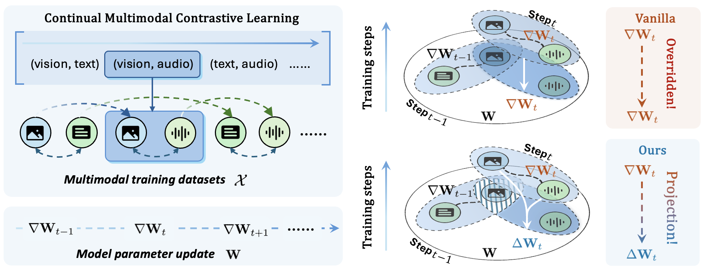
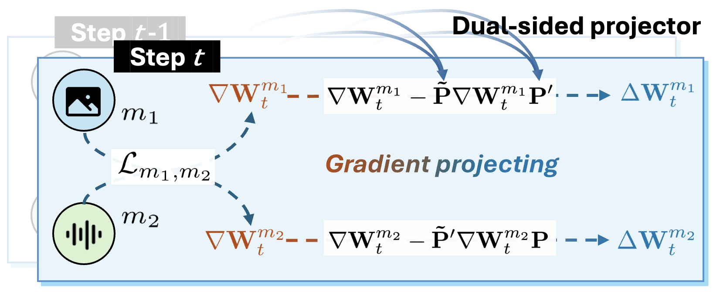

<div align=center>

<h1><a href="https://arxiv.org/pdf/2503.14963">Continual Multimodal Contrastive Learning (CMCL)</a></h1>


<h5 align="center">
<div>
      Xiaohao Liu,
      Xiaobo Xia,
      See-Kiong Ng,
      Tat-seng Chua
</div>
<div>
  National University of Singapore
</div>   
</h5>
</div>


  
## 🌟 Overview

Multimodal Contrastive Learning (MCL) has revolutionized the field by enabling effective alignment between different modalities and generating powerful multimodal representations in a joint space. By leveraging contrastive learning across diverse modalities, large-scale multimodal data significantly enhances representational quality. 
However, a critical yet often overlooked challenge remains: multimodal data is rarely collected in a single process, and training from scratch is computationally expensive. Instead, emergent multimodal data can be used to optimize existing models gradually, *i.e.*, models are trained on a sequence of modality pair data. We define this problem as **Continual Multimodal Contrastive Learning (CMCL)**, an underexplored yet crucial research direction at the intersection of multimodal and continual learning.
In this paper, we formulate CMCL through two specialized principles of stability and plasticity. We theoretically derive a novel optimization-based method, which projects updated gradients from dual sides onto subspaces where any gradient is prevented from interfering with the previously learned knowledge. Two upper bounds provide theoretical insights on both stability and plasticity in our solution. Beyond our theoretical contributions, we conduct experiments on multiple datasets by comparing our method against advanced continual learning baselines. The empirical results further support our claims and demonstrate the efficacy of our method. 

This repository provides the implementation of the CMCL framework, including datasets, models, and evaluation scripts to replicate and extend the results from the paper.

### 🎯 Dual-sided Null Space (DNS) 

<center></center>

**The paradigm of the proposed method (DNS) for CMCL**. 
At the current step $t$, gradients ($\nabla\mathbf{W}\_{t}^{m_1}$ and  $\nabla\mathbf{W}\_{t}^{m_1}$) derived by contrastive learning between modalities $m_1$ and $m_2$ are projected from dual sides to $\Delta\mathbf{W}\_{t}^{m_1}$ and  $\Delta\mathbf{W}\_{t}^{m_1}$. The projectors are built upon the features from the previous steps to constrain the gradients. By substituting for the gradients, model parameters are optimized from new modality pair data while retraining the prior knowledge.

## 🚀 Getting Started

### Prerequisites

- Python 3.10+
- PyTorch 2.5+
- CUDA-enabled GPU (optional, for faster training)

### Installation

```bash
# Install dependencies
pip install -r requirements.txt
```

### 📊 Dataset

We support the following datasets:
- UCF101
- ESC50
- NYUDv2
- VGGSound
- Clotho
- TVL
- LLVIP

Download and preprocess the datasets using our provided scripts:
```bash
bash dataset/download.sh
```

### 🔄 Modality-binding Methods

We support the following modality-binding methods:
- ImageBind
- LanguageBind
- UniBind

Download and preprocess the modality-binding methods:
```bash
python -m modal_encoder.download --perceptor="imagebind"
```


### 🎮 Training & Testing

#### Single GPU Training
```bash
CUDA_VISIBLE_DEVICES=0 python training.py \
    --disable_wandb=True \
    --perceptor=imagebind \
    --method=DNS \
    --log_name="full_training"
```

#### Training in Paralle
```bash
CUDA_VISIBLE_DEVICES=0,1,2,3 python3 training_p.py
```

---

<div align=center>
<h3>🌟 Empower your models to learn continually across modalities with CMCL! 🌟</h3>
</div>
